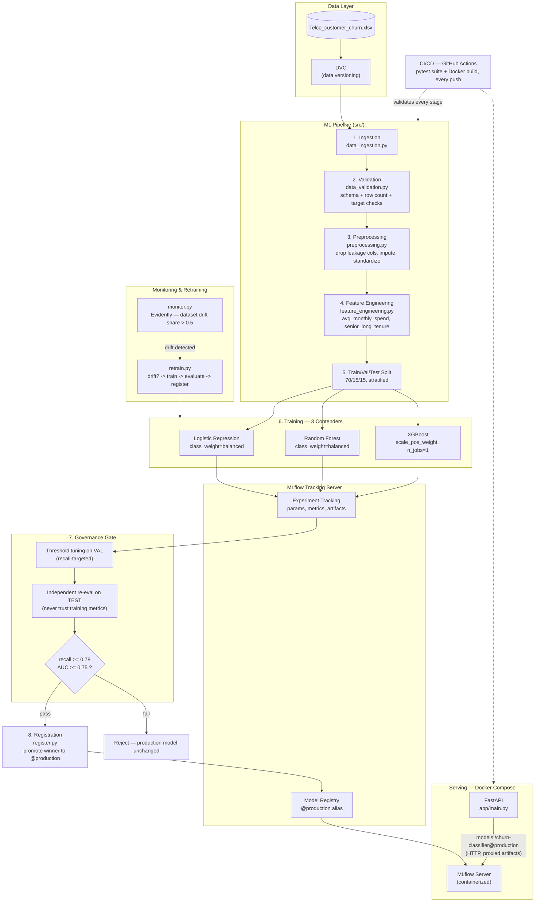

# Churn MLOps

A production-shaped MLOps pipeline for customer churn prediction — built stage by stage, with the same rigor a real team would apply: data contracts, experiment tracking, a governance gate before any model reaches production, containerized serving, drift monitoring, automated retraining, and CI/CD.

Dataset: [IBM Telco Customer Churn](https://www.kaggle.com/datasets/blastchar/telco-customer-churn) (7,043 customers, 33 raw columns).

---

## Architecture



---

## Pipeline stages

| Stage | File | What it does |
|---|---|---|
| Ingestion | `src/data_ingestion.py` | Loads raw `.xlsx`/`.csv`, fails loudly on a missing file |
| Validation | `src/data_validation.py` | Schema check, row-count bounds, target column integrity, null-rate warnings |
| Preprocessing | `src/preprocessing.py` | Drops 4 leakage columns + 9 no-signal ID columns, imputes `Total Charges`, standardizes binary Yes/No → 0/1 |
| Feature engineering | `src/feature_engineering.py` | Adds `avg_monthly_spend`, `senior_long_tenure` — same function used in training **and** serving, so there's no train/serve skew |
| Training | `src/train.py` | Trains Logistic Regression, Random Forest, and XGBoost; logs params/metrics/artifacts to MLflow |
| Evaluation | `src/evaluate.py` | Tunes each model's decision threshold on the validation set for a target recall, picks a winner, then **independently re-scores it on the held-out test set** — a governance gate, not a formality |
| Registration | `src/register.py` | Registers the approved model version and promotes it with the `@production` alias — serving code never hardcodes a version number |
| Serving | `app/main.py` | FastAPI app that resolves `models:/churn-classifier@production` at startup, applies the tuned threshold (not a naive 0.5), and runs the exact same feature engineering as training |
| Monitoring | `src/monitor.py` | Evidently dataset-drift report; flags drift on **share of drifted columns crossing threshold**, not "any column changed" |
| Retraining | `src/retrain.py` | Checks drift → if detected, chains train → evaluate → register automatically; if not, exits cleanly |

## Why these specific decisions

- **Leakage vs. no-signal columns, treated differently**: `Churn Score`, `Churn Reason`, `CLTV`, `Churn Label` are dropped because they leak the outcome; `CustomerID`, `Zip Code`, `Lat Long`, etc. are dropped because they carry no real signal, not because they're dangerous. Conflating these two reasons is a common mistake.
- **`class_weight='balanced'` / `scale_pos_weight` over SMOTE**: churn here is a moderate ~26.5% imbalance, and SMOTE's interpolation doesn't play well with one-hot encoded categorical features.
- **Recall-targeted threshold tuning, decoupled from training**: the business cost of missing a churner is asymmetric with the cost of a false alarm. The threshold is tuned on the validation set *after* training, as a separate decision — not baked into the model itself.
- **Independent test-set re-evaluation**: `evaluate.py` never trusts a model's self-reported training/validation metrics. It reloads the model and preprocessor from the MLflow artifact and recomputes everything from scratch on data the model has never seen.
- **Alias-based model promotion (`@production`)**: serving code resolves `models:/churn-classifier@production`, never a hardcoded version number. Promoting a new model means repointing one alias — zero redeploys, zero code changes.
- **`n_jobs=1` for XGBoost**: multi-threaded XGBoost training is not bit-for-bit reproducible even with a fixed `random_state`, due to floating-point race conditions across threads. Single-threaded training removed that.
- **MLflow artifacts served over HTTP (proxied mode)**, not local filesystem paths: when the tracking server's artifact root is a plain local path, any client not sharing that exact filesystem (e.g. a container that didn't mount the same volume) silently fails to read/write real files — metadata calls succeed over HTTP while the actual model bytes go nowhere. Running the server with `--default-artifact-root mlflow-artifacts:/` forces every client, container or host, to move artifact bytes over HTTP too.

## Results

Independently re-evaluated on the held-out test set (never seen during training or threshold tuning):

| Model | AUC | Precision | Recall | F1 | Threshold |
|---|---|---|---|---|---|
| Logistic Regression | 0.842 | 0.519 | 0.779 | 0.623 | 0.498 |
| Random Forest | 0.845 | 0.554 | 0.754 | 0.639 | 0.458 |
| **XGBoost (production)** | **0.851** | **0.512** | **0.789** | **0.621** | **0.44** |

Governance gate: recall ≥ 0.78 and AUC ≥ 0.75. XGBoost was selected — it met the recall target with the best validation precision among models that did.

## Project structure

```
churn-mlops/
├── src/
│   ├── data_ingestion.py
│   ├── data_validation.py
│   ├── preprocessing.py
│   ├── feature_engineering.py
│   ├── train.py
│   ├── evaluate.py
│   ├── register.py
│   ├── monitor.py
│   └── retrain.py
├── app/
│   ├── main.py          # FastAPI serving
│   └── schemas.py        # Pydantic request/response models
├── tests/
│   ├── test_pipeline.py  # 26 tests: contracts, robustness, regression
│   └── fixtures/
├── data/raw/              # DVC-tracked (not in git)
├── .github/workflows/
│   └── ci.yml             # pytest + Docker build, every push/PR
├── Dockerfile              # serving image
├── Dockerfile.mlflow        # tracking server image
├── docker-compose.yml
├── requirements.txt          # full dev environment
└── requirements-serving.txt   # slim image dependencies
```

## Running it

### Local (full pipeline)

```bash
python -m venv venv && source venv/Scripts/activate   # or venv/bin/activate on Linux/Mac
pip install -r requirements.txt

dvc pull                     # fetch the raw dataset

export MLFLOW_TRACKING_URI=http://localhost:5000   # point at a running mlflow server

python src/train.py
python src/evaluate.py
python src/register.py
```

### Docker (serving stack)

```bash
docker compose up -d
curl http://localhost:8000/health
```

### Monitoring + retraining

```bash
python src/retrain.py   # checks drift; retrains + re-registers only if detected
```

### Tests

```bash
pytest tests/test_pipeline.py -v
```

26 tests covering every pipeline stage, plus contract tests (churn-ratio preservation, output bounds, deterministic inference, threshold boundary logic) and a regression test locking in a real drift-detection bug fix (dataset-level drift is "share of columns drifted > threshold", not "any column drifted").

## CI/CD

Every push and PR to `main` runs via GitHub Actions (`.github/workflows/ci.yml`):
1. **test** — installs dependencies, runs the full pytest suite against a committed CSV copy of the dataset (CI runners can't reach the local DVC remote)
2. **docker-build** — builds both the serving and MLflow images, catching Dockerfile breakage before it reaches a real deploy

## Known limitations / deferred

- **Cross-validation**: model comparison currently uses a single train/val/test split rather than k-fold CV. The margin between XGBoost and Logistic Regression on test recall is thin enough that CV would give a more statistically grounded comparison — deferred to keep scope focused on the end-to-end pipeline first.
- **Orchestration (Airflow)**: the drift-check → retrain logic in `retrain.py` is fully functional and could be wrapped in an Airflow DAG for scheduled execution with per-task visibility in a UI. Deliberately left out of this version — it would add infrastructure without adding new ML engineering substance, and the existing CLI-driven retraining already demonstrates the same orchestration logic.
- **DVC remote**: configured against a local filesystem remote for this project; in a real deployment this would point to S3/GCS.
